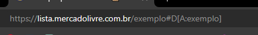
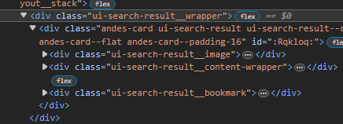
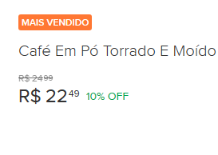
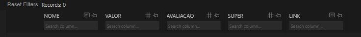
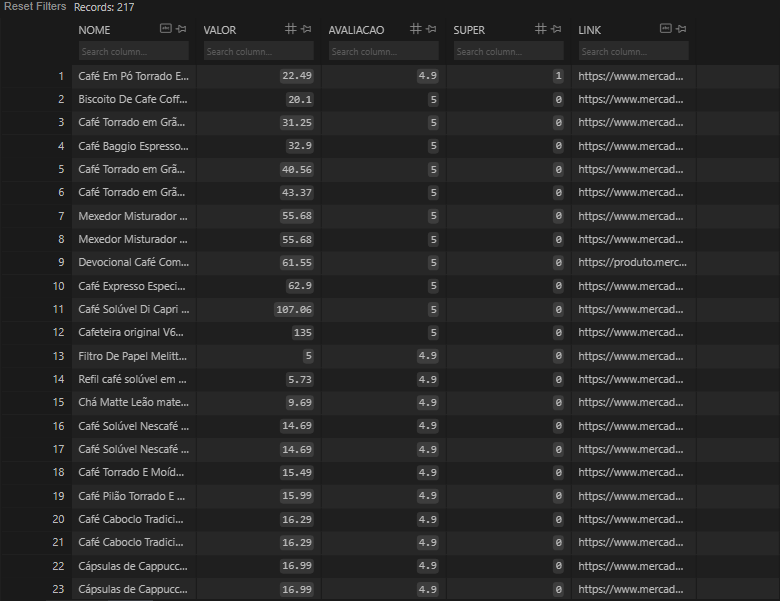

<h1>Algoritmo de pesquisa no Mercado Livre</h1>

Utilizando das bibliotecas: Requests, BeautifulSoup4, Regex e sqlite3 consegui criar um algoritmo que pesquisa um determinado item no site "Mercado Livre" e implementa em um banco de dados com suas respectivas características. Ao todo, por padrão, serão analisadas 5 paginas do site sobre o item.

<h2>Algoritmo de pesquisa</h2>

No site do <a href="https://www.mercadolivre.com.br/" rel="external" target="_blank">Mercado Livre</a> os parâmetros funcionam da seguinte maneira:

<h3>URL</h3>

<h3>DIV</h3>

Todos os recursos que serão disponibilizados de um produto vem dentro dessa <code>div class="ui-search-result__wrapper"</code>
incluindo um caso em especifico de uma tag de "MAIS VENDIDO" como nesse exemplo do pó de café:

Isso é possível identificar dentro do html por causa de uma div específica <code>div class="ui-search-item__highlight-label ui-search-item__highlight-label--best_seller"</code>

<h2>Banco de dados</h2>

O banco foi dividido em duas tabelas que vão ficar trocando valores entre si para se reorganizarem, a tabela PRODUTOS e a SORTED_PRODUTOS

No final, os itens serão organizados de maneira crescente pelo seu valor, descrescente pela sua qualidade e dando uma prioridade superior para a categoria SUPER, que é justamente se houver a condição de "MAIS VENDIDO"

<h3>Exemplo com o café</h3>

